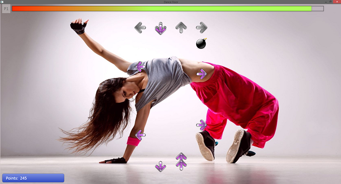
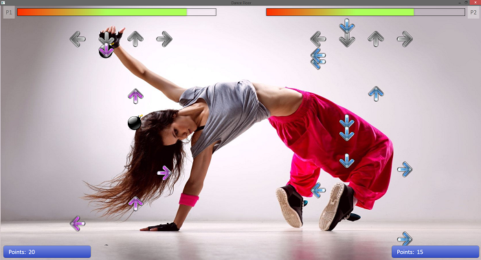

# Dance Floor

This game has been created to practice C# WPF.  
It's a simplified version of [StepMania](https://github.com/stepmania).  

You can check out project architecture [here](_Project Architecture/Game.html) (not everything is up to date).

## Screenshots
Single player:  
  
Multiplayer:  

## Download
You can download binaries [here](_Binaries/DanceFloor.zip).

## How to play?
- Use arrows (1st player) and WSAD (2nd player).  
- Unfortunately the game doesn't contain prepared songs, because of licenses. However, you can easily generate your own songs using mp3 files.

# Used libraries
- [Caliburn.Micro](https://github.com/Caliburn-Micro/Caliburn.Micro)

# To do 
- settings
- highscores
- sounds (for example while hitting keys)